# SLICE CUOTAS

## Índice

  - [DIAGRAMA ER](#diagrama-er)
  - [Tablas de la Base de Datos](#tablas-de-la-base-de-datos)
      - [Tabla: temporadas\_cuota](#tabla-temporadas_cuota)
      - [Tabla: tipos\_de\_cuota](#tabla-tipos_de_cuota-nueva)
      - [Tabla: cuotas](#tabla-cuotas-actualizada)
  - [Casos De Uso](#casos-de-uso)
  - [Diagramas de Secuencia](#diagramas-de-secuencia)

-----

## DIAGRAMA ER

-----

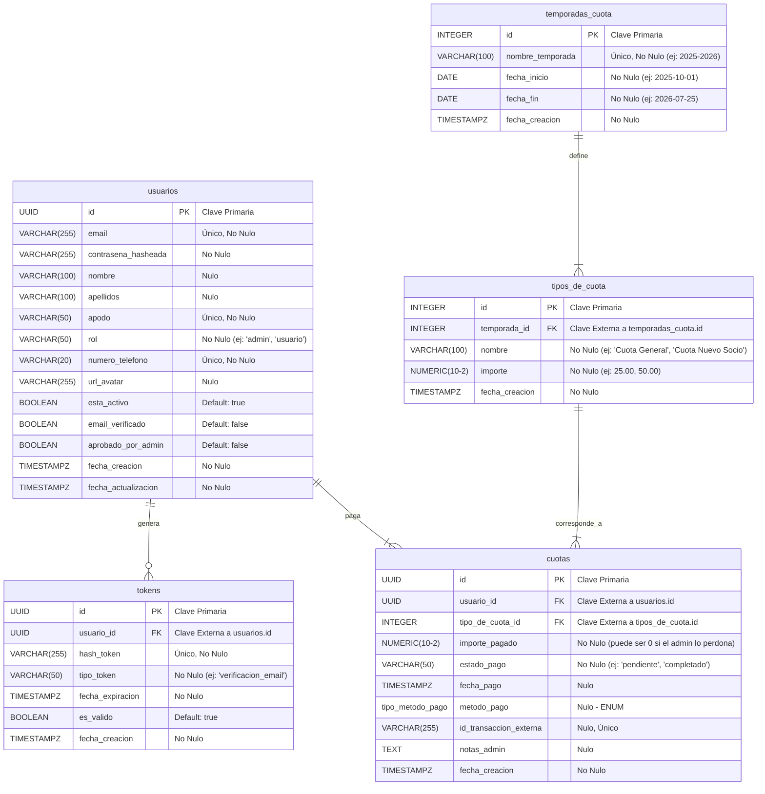

-----

## Tablas de la Base de Datos

-----

## Tabla: temporadascuotas

| Nombre de Columna | Tipo de Dato | Restricciones / Notas |
| :--- | :--- | :--- |
| **id** | INTEGER | Clave Primaria (Autoincremental) |
| **nombre\_temporada**| VARCHAR(100) | Único, No Nulo. Ej: "Temporada 2025-2026" |
| **fecha\_inicio** | DATE | No Nulo. Ej: '2025-10-01' |
| **fecha\_fin** | DATE | No Nulo. Ej: '2026-07-25' |
| **fecha\_creacion** | TIMESTAMPZ | No Nulo |

## Tabla: tipocuotas 

| Nombre de Columna | Tipo de Dato | Restricciones / Notas |
| :--- | :--- | :--- |
| **id** | INTEGER | Clave Primaria (Autoincremental) |
| **temporada\_id** | INTEGER | Clave Externa a `temporadas_cuota.id` |
| **nombre** | VARCHAR(100) | No Nulo. Ej: "Cuota General", "Cuota Nuevo Socio" |
| **importe** | NUMERIC(10, 2) | No Nulo. Ej: 25.00 |
| **fecha\_creacion** | TIMESTAMPZ | No Nulo |

## Tabla: cuotas 

| Nombre de Columna | Tipo de Dato | Restricciones / Notas |
| :--- | :--- | :--- |
| **id** | UUID | Clave Primaria |
| **usuario\_id** | UUID | Clave Externa a `usuarios.id` |
| **tipo\_de\_cuota\_id**| INTEGER | Clave Externa a `tipos_de_cuota.id` |
| **importe\_pagado** | NUMERIC(10, 2) | No Nulo. El importe real pagado (puede diferir). |
| **estado\_pago** | VARCHAR(50) | No Nulo. Ej: 'pendiente', 'completado', 'fallido' |
| **fecha\_pago** | TIMESTAMPZ | Nulo (se rellena cuando el estado es 'completado') |
| **metodo\_pago** | `tipo_metodo_pago` | Nulo. **ENUM:** ('stripe', 'efectivo', 'transferencia\_manual') |
| **id\_transaccion\_externa**| VARCHAR(255) | Nulo, Único. (Ej: el ID de Stripe) |
| **notas\_admin** | TEXT | Nulo. Para justificar pagos manuales, etc. |
| **fecha\_creacion** | TIMESTAMPZ | No Nulo |

-----

## Casos De Uso

-----

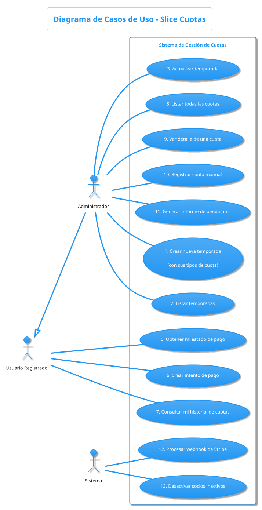

-----

## Diagramas de Secuencia

-----

### CASO DE USO 1: Crear Nueva Temporada

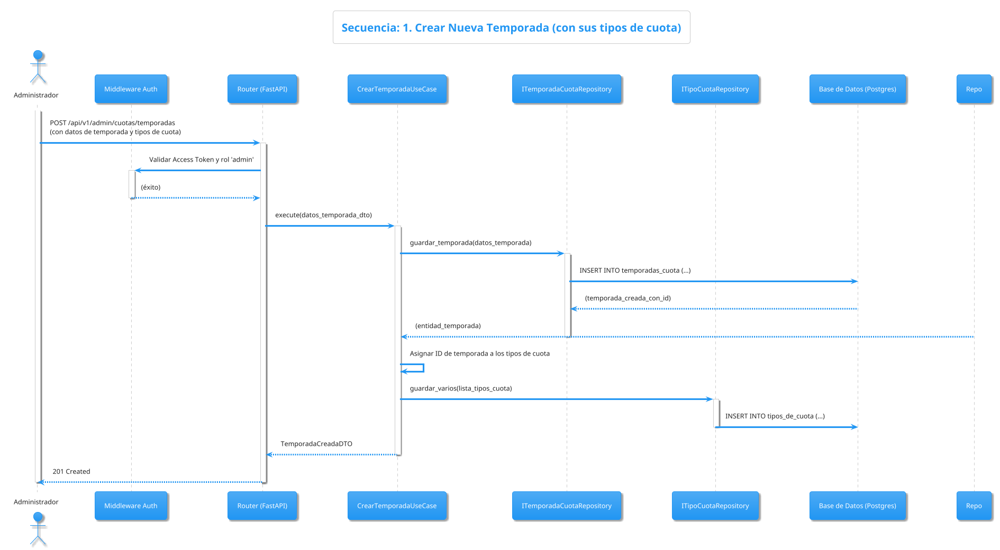

-----

### CASO DE USO 2: Listar Temporadas

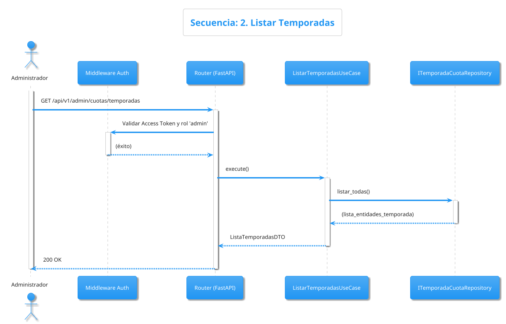

-----

### CASO DE USO 3: Actualizar Temporada

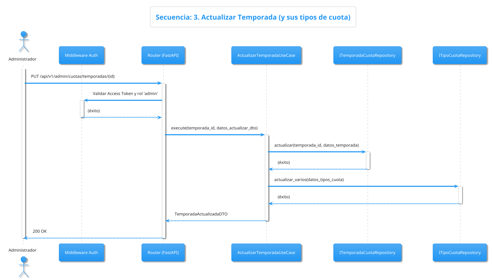

-----

### CASO DE USO 4: Listar Todas las Cuotas (Admin)

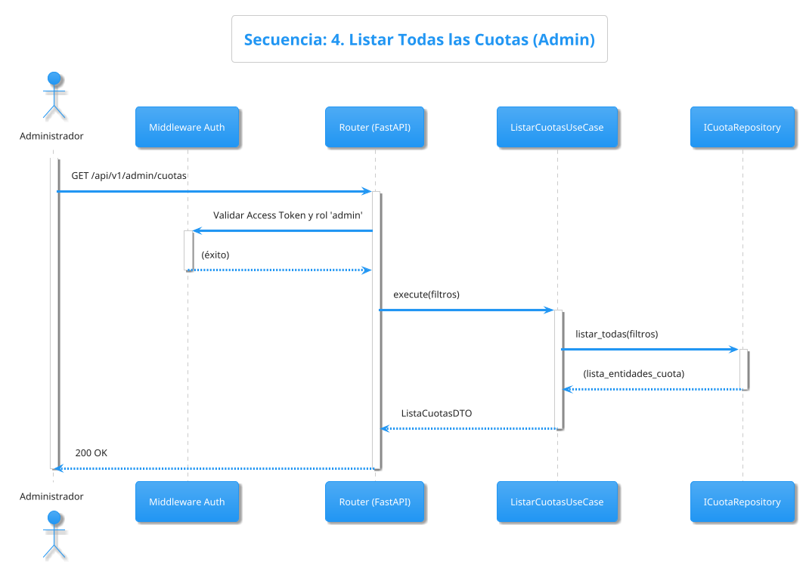

-----

### CASO DE USO 5: Obtener Mi Estado de Pago

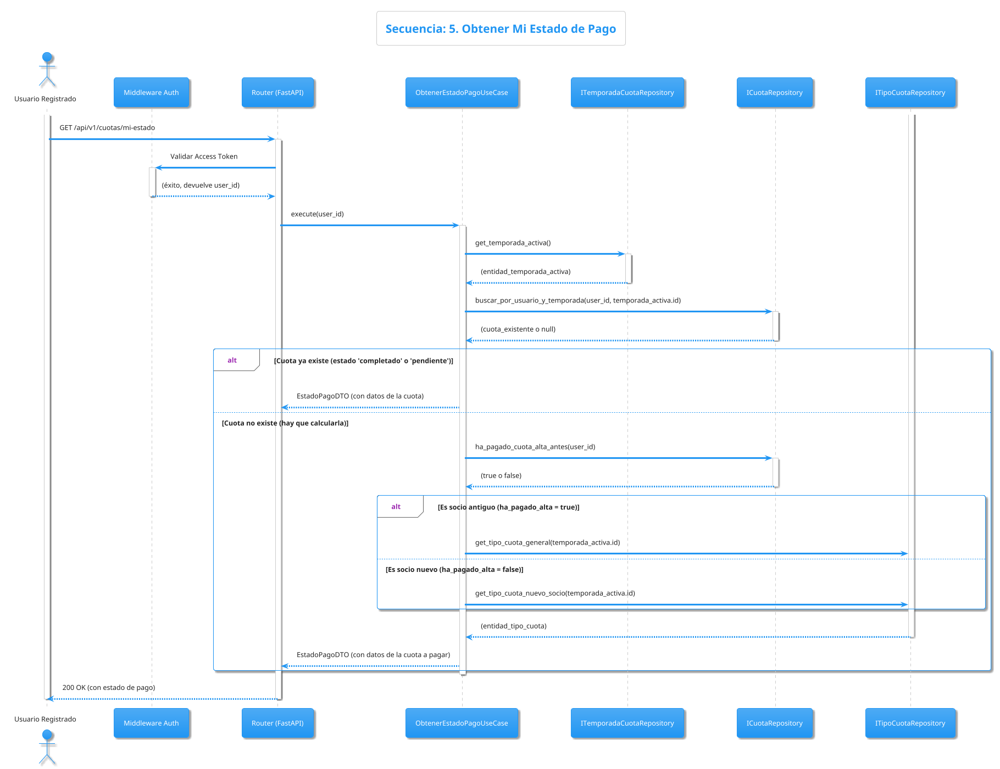

-----

### CASO DE USO 6: Crear Intento de Pago

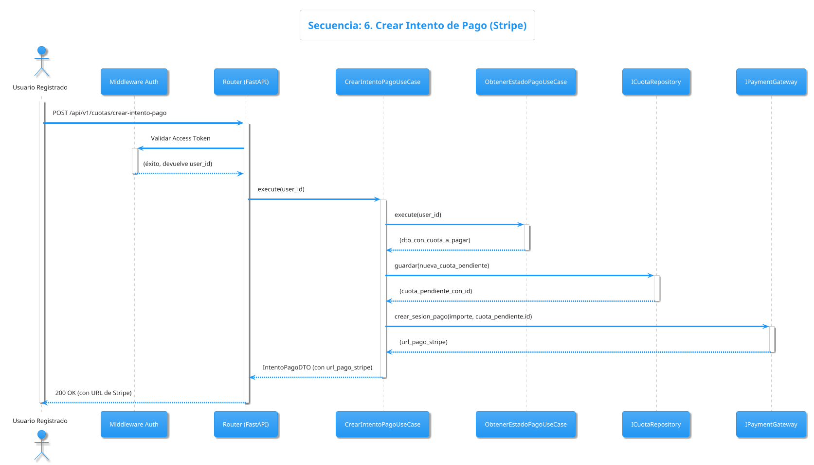

-----

### CASO DE USO 7: Consultar Mi Historial de Cuotas

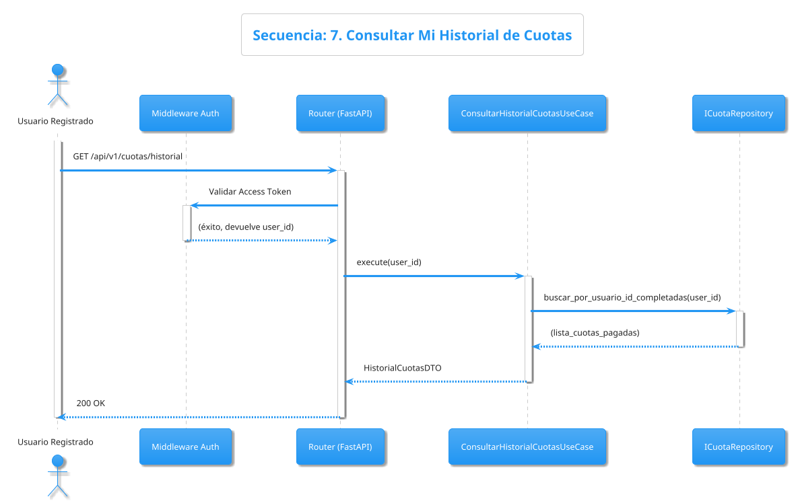

-----

### CASO DE USO 8: Ver Detalle de una Cuota (Admin)

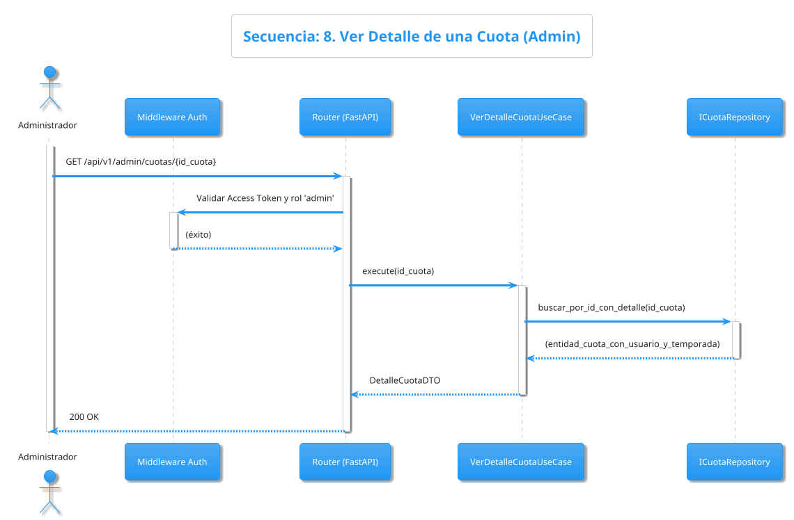

-----

### CASO DE USO 9: Registrar Cuota Manual (Admin)

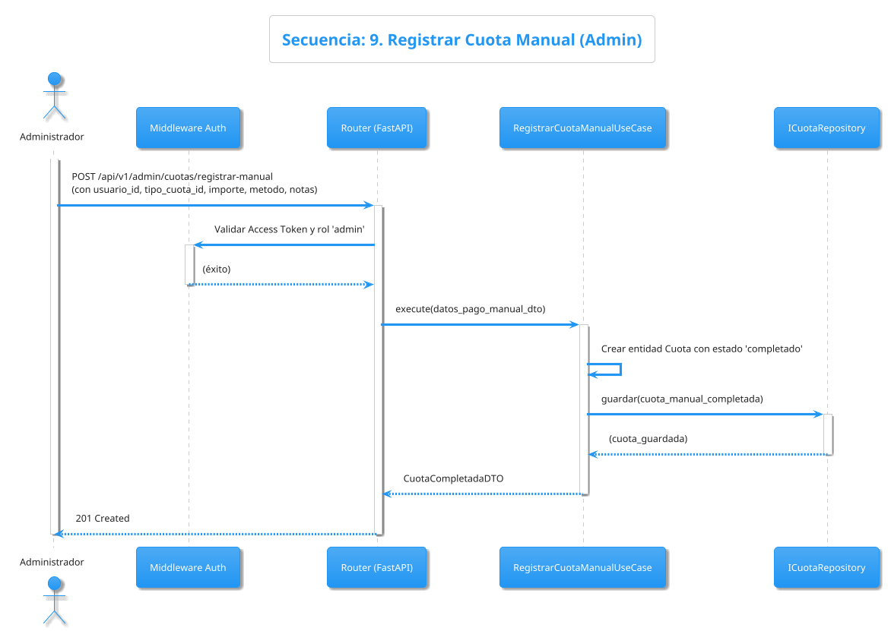

-----

### CASO DE USO 10: Generar Informe de Pendientes (Admin)

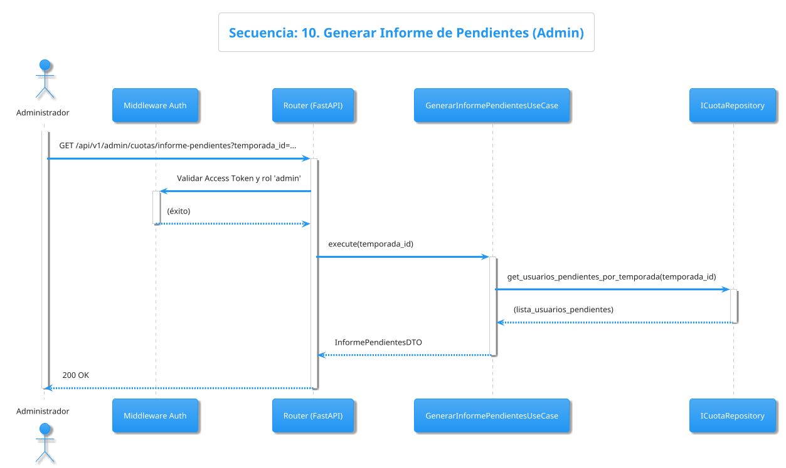

-----

### CASO DE USO 11: Procesar Webhook de Stripe

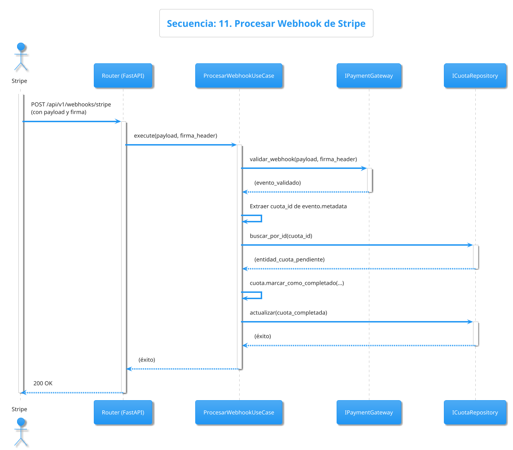

-----

### CASO DE USO 12: Desactivar Socios Inactivos

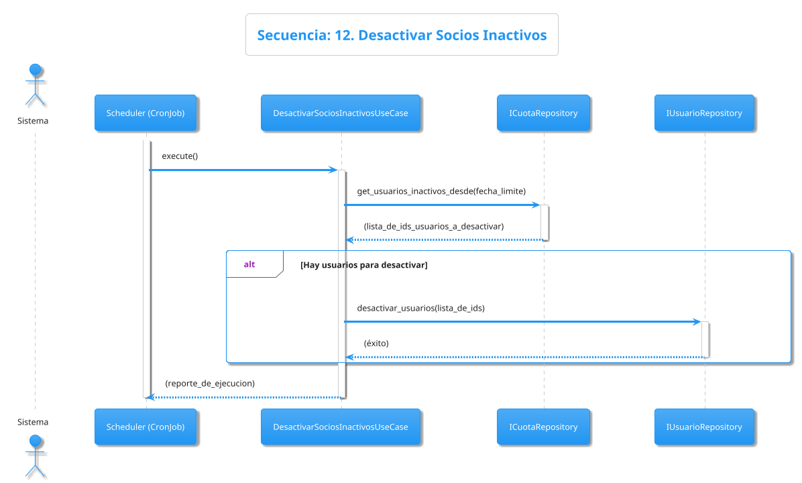