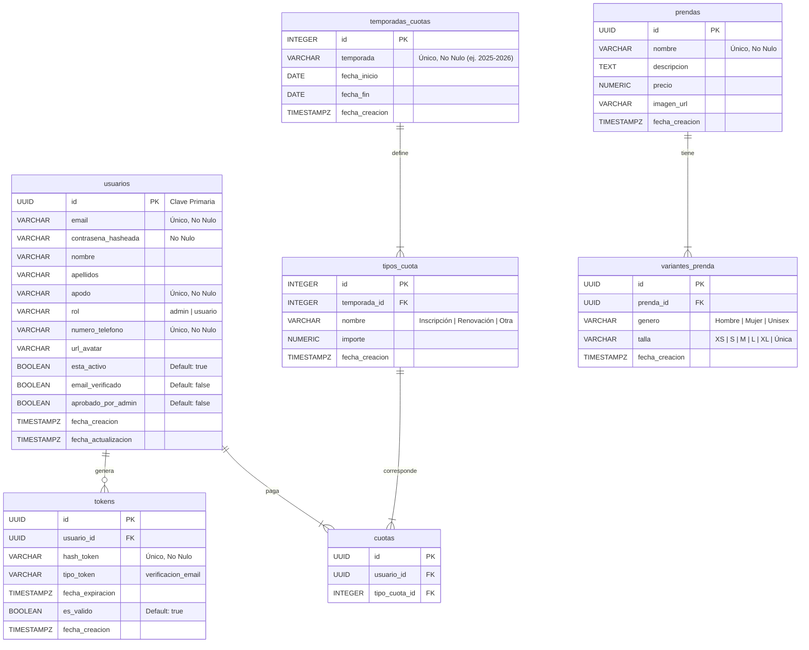
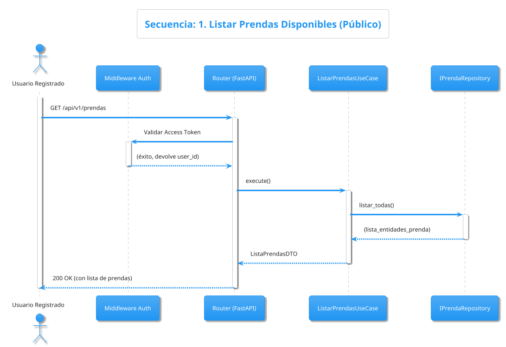
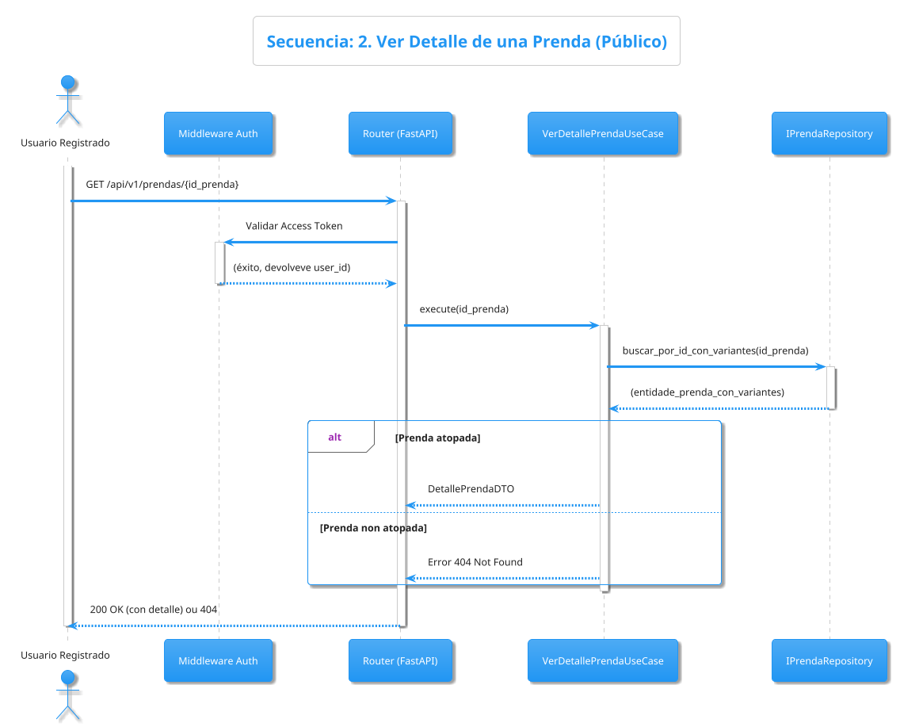
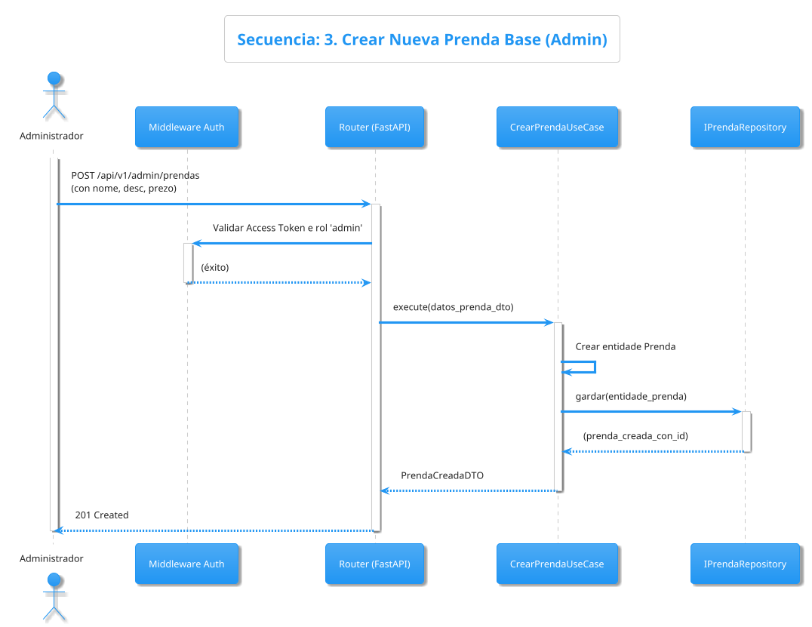
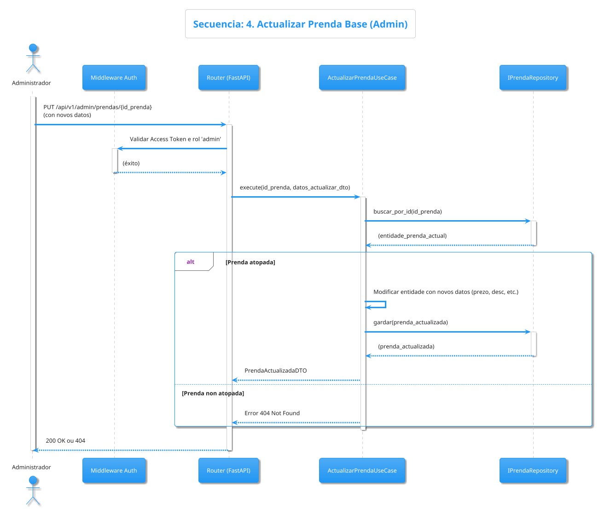
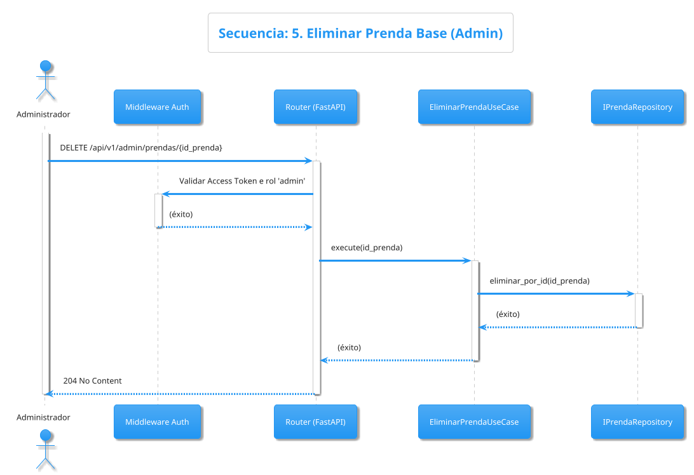
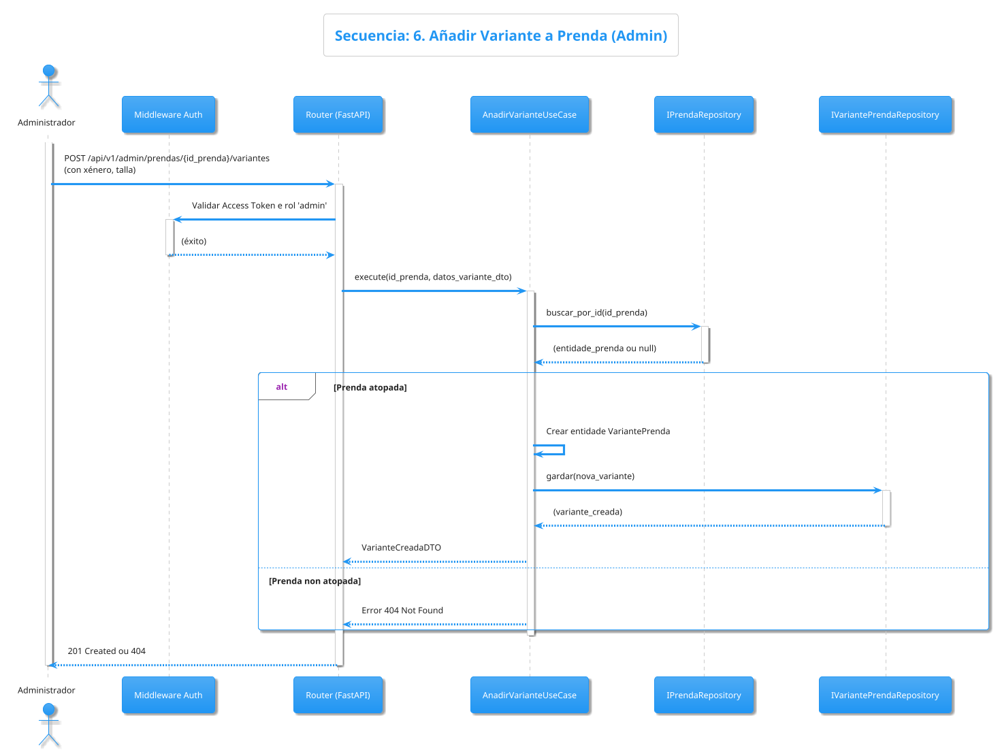
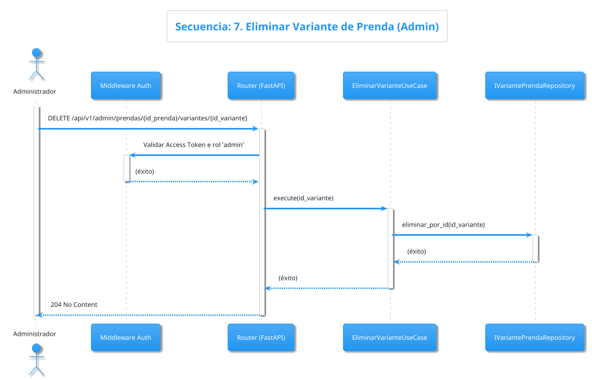

Entendido. É unha simplificación máis. Se as variantes só se definen pola súa talla e xénero (ex: "Camisa - Home - L"), o modelo é aínda máis directo.

Aquí tes o documento Markdown completo para o **SLICE PRENDAS**, co E-R e as táboas actualizadas para reflectir que `variantes_prenda` **non inclúe `cor` nin `sku`**.

-----

# SLICE PRENDAS

## Índice

  - [DIAGRAMA ER](#diagrama-er)
  - [Tablas de la Base de Datos](#tablas-de-la-base-de-datos)
      - [Tabla: prendas](#tabla-prendas)
      - [Tabla: variantes\_prenda](#tabla-variantes_prenda)
  - [Casos De Uso](#casos-de-uso)
  - [Diagramas de Secuencia](#diagramas-de-secuencia)

-----

## DIAGRAMA ER

-----

-----

## Tablas de la Base de Datos

-----

## Tabla: prendas

| Nombre de Columna | Tipo de Dato | Restricciones / Notas |
| :--- | :--- | :--- |
| **id** | UUID | Clave Primaria |
| **nome** | VARCHAR(100) | Único, No Nulo. Ej: "Camisa", "Polo", "Gorra" |
| **descripcion** | TEXT | Nulo. |
| **prezo** | NUMERIC(10, 2) | No Nulo. Precio de la prenda (independente de talla/genero). |
| **imaxe\_url** | VARCHAR(255) | Nulo. Imagen principal del produto. |
| **fecha\_creacion** | TIMESTAMPZ | No Nulo |

## Tabla: varianteprendas

| Nombre de Columna | Tipo de Dato | Restricciones / Notas |
| :--- | :--- | :--- |
| **id** | UUID | Clave Primaria |
| **prenda\_id** | UUID | Clave Externa a `prendas.id` |
| **xenero** | `tipogenero` | **ENUM:** ('Hombre', 'Mujer', 'Unisex'). |
| **talla** | `tipotalla` | **ENUM:** ('XS', 'S', 'M', 'L', 'XL', 'Unica'). |
| **fecha\_creacion** | TIMESTAMPZ | No Nulo |

-----

## Casos De Uso

-----

### 1\. Casos de Uso Públicos / Compartidos

1.  **Listar Prendas Disponibles**
      * **Lógica:** Un usuario (registrado o admin) solicita ver el catálogo. El sistema devuelve una lista de todas las `Prendas` con su nombre, precio general y foto principal.
2.  **Ver Detalle de una Prenda**
      * **Lógica:** Un usuario (registrado o admin) selecciona una prenda. El sistema devuelve la información detallada de esa `Prenda` y la lista completa de sus `Variantes` (tallas, géneros).

### 2\. Casos de Uso del Administrador (CRUD)

3.  **Crear Nueva Prenda Base**
      * **Lógica:** Un administrador añade un nuevo tipo de artículo al catálogo. El sistema le pide el nombre, la descripción, la foto principal y el **precio general** que tendrá ese artículo.
4.  **Actualizar Prenda Base**
      * **Lógica:** Un administrador edita la información de una prenda existente (ej: cambia la descripción, la foto o actualiza el **precio** general del artículo).
5.  **Eliminar Prenda Base**
      * **Lógica:** Un administrador elimina una prenda del catálogo. El sistema la borra, junto con todas las `Variantes` que tenía asociadas.
6.  **Añadir Variante a Prenda**
      * **Lógica:** Un administrador selecciona una prenda base (ej: "Camisa") y le añade una nueva combinación disponible (ej: "Mujer - Talla M").
7.  **Eliminar Variante de Prenda**
      * **Lógica:** Un administrador elimina una variante específica (ej: "Hombre - Talla S") de una prenda, sin necesidad de borrar la prenda completa.

-----

## Diagramas de Secuencia

-----

Aquí os tes.

Xerei os 7 diagramas de secuencia para o slice `Prendas`, seguindo a numeración da lista de casos de uso que consolidamos e a nosa arquitectura.

-----

## Diagramas de Secuencia

-----

### CASO DE USO 1: Listar Prendas Disponibles

-----

### CASO DE USO 2: Ver Detalle de una Prenda

-----

### CASO DE USO 3: Crear Nueva Prenda Base (Admin)

-----

### CASO DE USO 4: Actualizar Prenda Base (Admin)

-----

### CASO DE USO 5: Eliminar Prenda Base (Admin)

-----

### CASO DE USO 6: Añadir Variante a Prenda (Admin)

-----

### CASO DE USO 7: Eliminar Variante de Prenda (Admin)

