# SLICE USERS

## Índice

- [Diagrama ER](#diagrama-er)
- [Tablas de la Base de Datos](#tablas-de-la-base-de-datos)
  - [Tabla: usuarios](#tabla-usuarios)
  - [Tabla: roles](#tabla-roles)
  - [Tabla: usuario_roles](#tabla-usuario_roles-tabla-intermedia-para-relación-muchos-a-muchos)
  - [Tabla: tokens](#tabla-tokens-para-acciones-de-un-solo-uso)
- [Casos De Uso](#casos-de-uso)

---
## DIAGRAMA ER
---

```mermaid
erDiagram
 usuarios {
     UUID id PK "Clave Primaria"
     VARCHAR(255) email "Único, No Nulo"
     VARCHAR(255) contrasena_hasheada "No Nulo"
     VARCHAR(100) nombre "Nulo"
     VARCHAR(100) apellidos "Nulo"
     VARCHAR(50) apodo "Único, No Nulo"
     VARCHAR(20) numero_telefono "Único, No Nulo"
     VARCHAR(255) url_avatar "Nulo"
     BOOLEAN esta_activo "Default: true"
     BOOLEAN email_verificado "Default: false"
     BOOLEAN aprobado_por_admin "Default: false"
     TIMESTAMPZ fecha_creacion "No Nulo"
     TIMESTAMPZ fecha_actualizacion "No Nulo"
 }
 roles {
     INTEGER id PK "Clave Primaria"
     VARCHAR(50) nombre "Único, No Nulo (ej: 'admin')"
     TEXT descripcion "Nulo"
 }
 usuario_roles {
     UUID usuario_id PK, FK "Clave Primaria Compuesta y Externa"
     INTEGER rol_id PK, FK "Clave Primaria Compuesta y Externa"
 }
 tokens {
     UUID id PK "Clave Primaria"
     UUID usuario_id FK "Clave Externa a usuarios.id"
     VARCHAR(255) hash_token "Único, No Nulo"
     VARCHAR(50) tipo_token "No Nulo (ej: 'verificacion_email')"
     TIMESTAMPZ fecha_expiracion "No Nulo"
     BOOLEAN es_valido "Default: true"
     TIMESTAMPZ fecha_creacion "No Nulo"
     
 }
 usuarios ||--|{ usuario_roles : "tiene"
 roles ||--|{ usuario_roles : "pertenece_a"
 usuarios ||--o{ tokens : "genera"
 ```

---
# Tablas de la Base de Datos
---
## Tabla: usuarios
| Nombre de Columna | Tipo de Dato | Restricciones / Notas |
| :--- | :--- | :--- |
| **id** | UUID | Clave Primaria |
| **email** | VARCHAR(255) | Único, No Nulo |
| **contrasena_hasheada**| VARCHAR(255) | No Nulo |
| **nombre** | VARCHAR(100) | Nulo (Opcional) |
| **apellidos** | VARCHAR(100) | Nulo (Opcional) |
| **apodo** | VARCHAR(50) | Único, No Nulo |
| **numero_telefono** | VARCHAR(20) | Único, No Nulo |
| **url_avatar** | VARCHAR(255) | Nulo (Opcional) |
| **esta_activo** | BOOLEAN | Default: true |
| **email_verificado** | BOOLEAN | Default: false. Verificado por el usuario. |
| **aprobado_por_admin** | BOOLEAN | Default: false. Aprobado por un administrador. |
| **fecha_creacion** | TIMESTAMPZ | No Nulo |
| **fecha_actualizacion** | TIMESTAMPZ | No Nulo |

Tabla: roles
| Nombre de Columna | Tipo de Dato | Restricciones / Notas |
| :--- | :--- | :--- |
| **id** | INTEGER | Clave Primaria (Autoincremental) |
| **nombre** | VARCHAR(50) | Único, No Nulo (ej: 'admin', 'usuario') |
| **descripcion** | TEXT | Nulo (Opcional) |

Tabla: usuario_roles (Tabla intermedia para relación Muchos a Muchos)
| Nombre de Columna | Tipo de Dato | Restricciones / Notas |
| :--- | :--- | :--- |
| **usuario_id** | UUID | Clave Primaria Compuesta y Clave Externa a usuarios.id |
| **rol_id** | INTEGER | Clave Primaria Compuesta y Clave Externa a roles.id |

Tabla: tokens (Para acciones de un solo uso)
| Nombre de Columna | Tipo de Dato | Restricciones / Notas |
| :--- | :--- | :--- |
| **id **| UUID | Clave Primaria |
| **usuario_id** | UUID | Clave Externa a usuarios.id |
| **hash_token** | VARCHAR(255) | Único, No Nulo. Se guarda el hash del token. |
| **tipo_token** **| VARCHAR(50) | No Nulo (ej: 'verificacion_email', 'reseteo_contrasena') |
| **fecha_expiracion** | TIMESTAMPZ | No Nulo |
| **es_valido** | BOOLEAN | Default: true. Indica si el token no ha sido usado. |
| **fecha_creacion** | TIMESTAMPZ | No Nulo |


---
## Casos De Uso
---

```plantUML

@startuml
!theme materia
' Título del Diagrama
title Diagrama de Casos de Uso  - Slice de Usuarios
left to right direction
' Definición de Actores
actor Invitado
actor "Usuario Registrado" as User
actor Administrador

' Definición de Herencia
User <|-- Administrador

' Contenedor del Sistema
rectangle "Sistema de Gestión de Usuarios" {
  ' --- Casos de Uso Principales ---
  usecase UC1 as "1. Registrar cuenta"
  usecase UC2 as "2. Confirmar email"
  usecase UC3 as "3. Reenviar email"
  usecase UC4 as "4. Iniciar sesión"
  usecase UC5 as "5. Solicitar reseteo de contraseña"
  usecase UC6 as "6. Confirmar nueva contraseña"
  usecase UC7 as "7. Refrescar sesión"
  usecase UC8 as "8. Cerrar sesión"
  usecase UC9 as "9. Ver mi perfil"
  usecase UC10 as "10. Actualizar mi perfil"
  usecase UC11 as "11. Cambiar mi contraseña"
  usecase UC12 as "12. Solicitar eliminación"
  usecase UC13 as "13. Listar usuarios"
  usecase UC14 as "14. Ver perfil de otro usuario"
  usecase UC15 as "15. Aprobar usuario"
  usecase UC16 as "16. Rechazar usuario"
  usecase UC17 as "17. Activar/Desactivar usuario"
  usecase UC18 as "18. Modificar roles"
  usecase UC19 as "19. Desbloquear cuenta"
  usecase UC20 as "20. Eliminar usuario"
  usecase UC21 as "21. Forzar reseteo"

  ' --- Casos de Uso Técnicos / Reutilizables ---
  usecase GenJWT as "(Generar Tokens JWT)"

  ' --- Asociaciones de Actores ---
  Invitado -- UC1
  Invitado -- UC2
  Invitado -- UC3
  Invitado -- UC4
  Invitado -- UC5
  Invitado -- UC6

  User -- UC7
  User -- UC8
  User -- UC9
  User -- UC10
  User -- UC11
  User -- UC12

  Administrador -- UC13
  Administrador -- UC14
  Administrador -- UC19
  Administrador -- UC20
  Administrador -- UC21

  ' --- Relaciones <<include>> ---
  ' Iniciar sesión y Refrescar sesión DEBEN generar tokens.
  UC4 .> GenJWT : <<include>>
  UC7 .> GenJWT : <<include>>


  ' --- Relaciones <<extend>> ---
  ' Desde la lista de usuarios, el admin OPCIONALMENTE
  ' puede realizar estas acciones.
  UC15 .> UC13 : <<extend>>
  UC16 .> UC13 : <<extend>>
  UC17 .> UC13 : <<extend>>
  UC18 .> UC13 : <<extend>>
}
@enduml
```

---
## DIAGRAMA DE SECUENCIAS
---
### CASO DE USO 1: Registrar Nueva Cuenta de Usuario
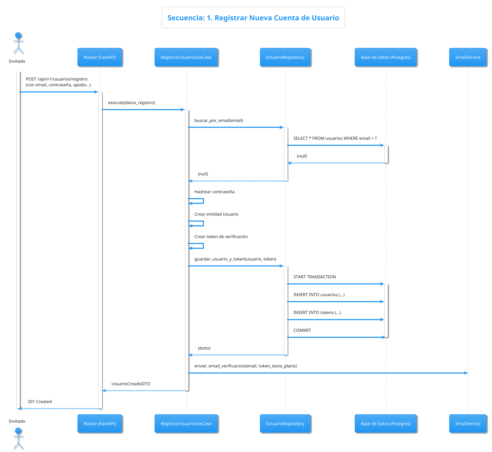
```plantuml
@startuml
!theme materia
title Secuencia: 1. Registrar Nueva Cuenta de Usuario

actor Invitado
participant "Router (FastAPI)" as API
participant "RegistrarUsuarioUseCase" as UseCase
participant "IUsuarioRepository" as Repo
participant "Base de Datos (Postgres)" as DB

activate Invitado
Invitado -> API: POST /api/v1/usuarios/registro\n(con email, contraseña, apodo...)
activate API

API -> UseCase: execute(datos_registro)
activate UseCase

UseCase -> Repo: buscar_por_email(email)
activate Repo
Repo -> DB: SELECT * FROM usuarios WHERE email = ?
activate DB
DB --> Repo: (null)
deactivate DB
Repo --> UseCase: (null)
deactivate Repo

UseCase -> UseCase: Hashear contraseña
UseCase -> UseCase: Crear entidad Usuario
UseCase -> UseCase: Crear token de verificación

UseCase -> Repo: guardar_usuario_y_token(usuario, token)
activate Repo
Repo -> DB: START TRANSACTION
activate DB
Repo -> DB: INSERT INTO usuarios (...)
Repo -> DB: INSERT INTO tokens (...)
Repo -> DB: COMMIT
deactivate DB
Repo --> UseCase: (éxito)
deactivate Repo


UseCase -> EmailService: enviar_email_verificacion(email, token_texto_plano)

UseCase --> API: UsuarioCreadoDTO
deactivate UseCase

API --> Invitado: 201 Created
deactivate API
deactivate Invitado
@enduml
```
---
### CASO DE USO 2: Confirmar Email de Usuario

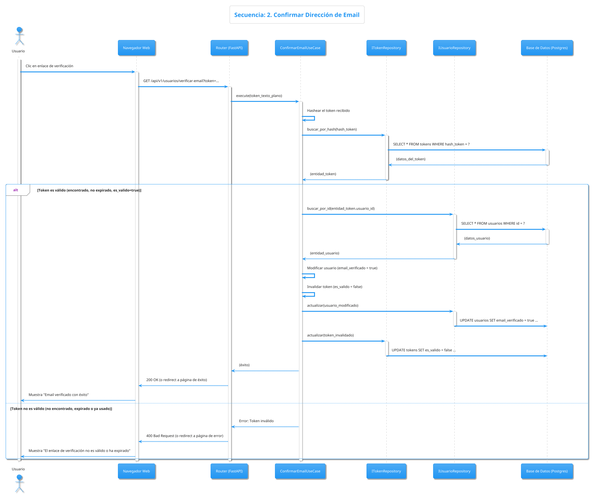
```plantuml
@startuml
!theme materia
title Secuencia: 2. Confirmar Dirección de Email

actor Usuario
participant "Navegador Web" as Browser
participant "Router (FastAPI)" as API
participant "ConfirmarEmailUseCase" as UseCase
participant "ITokenRepository" as TokenRepo
participant "IUsuarioRepository" as UserRepo
participant "Base de Datos (Postgres)" as DB

activate Usuario
Usuario -> Browser: Clic en enlace de verificación
activate Browser

Browser -> API: GET /api/v1/usuarios/verificar-email?token=...
activate API

API -> UseCase: execute(token_texto_plano)
activate UseCase

UseCase -> UseCase: Hashear el token recibido
UseCase -> TokenRepo: buscar_por_hash(hash_token)
activate TokenRepo

TokenRepo -> DB: SELECT * FROM tokens WHERE hash_token = ?
activate DB
DB --> TokenRepo: (datos_del_token)
deactivate DB
TokenRepo --> UseCase: (entidad_token)
deactivate TokenRepo

alt Token es válido (encontrado, no expirado, es_valido=true)
    UseCase -> UserRepo: buscar_por_id(entidad_token.usuario_id)
    activate UserRepo
    UserRepo -> DB: SELECT * FROM usuarios WHERE id = ?
    activate DB
    DB --> UserRepo: (datos_usuario)
    deactivate DB
    UserRepo --> UseCase: (entidad_usuario)
    deactivate UserRepo

    UseCase -> UseCase: Modificar usuario (email_verificado = true)
    UseCase -> UseCase: Invalidar token (es_valido = false)

    ' Idealmente, estas dos operaciones ocurren en una única transacción
    UseCase -> UserRepo: actualizar(usuario_modificado)
    activate UserRepo
    UserRepo -> DB: UPDATE usuarios SET email_verificado = true ...
    deactivate UserRepo

    UseCase -> TokenRepo: actualizar(token_invalidado)
    activate TokenRepo
    TokenRepo -> DB: UPDATE tokens SET es_valido = false ...
    deactivate TokenRepo

    UseCase --> API: (éxito)
    API --> Browser: 200 OK (o redirect a página de éxito)
    Browser --> Usuario: Muestra "Email verificado con éxito"

else Token no es válido (no encontrado, expirado o ya usado)
    UseCase --> API: Error: Token inválido
    API --> Browser: 400 Bad Request (o redirect a página de error)
    Browser --> Usuario: Muestra "El enlace de verificación no es válido o ha expirado"
end

deactivate UseCase
deactivate API
deactivate Browser
deactivate Usuario

@enduml
```
---
### CASO DE USO 3: Reenviar Email de Verificación

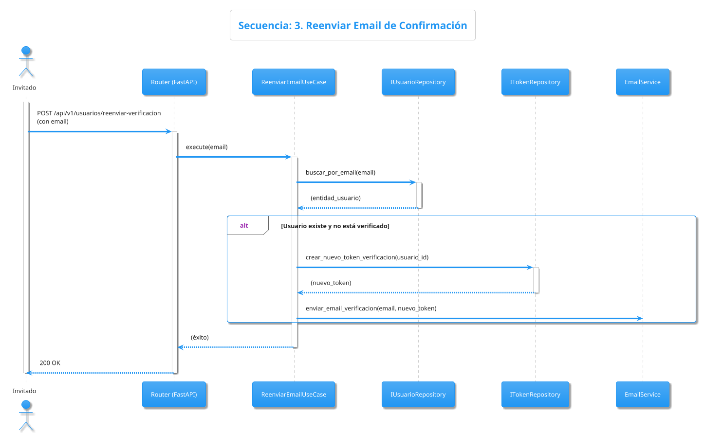
```plantuml
@startuml
!theme materia
title Secuencia: 3. Reenviar Email de Confirmación

actor Invitado
participant "Router (FastAPI)" as API
participant "ReenviarEmailUseCase" as UseCase
participant "IUsuarioRepository" as UserRepo
participant "ITokenRepository" as TokenRepo
participant "EmailService" as EmailService

activate Invitado
Invitado -> API: POST /api/v1/usuarios/reenviar-verificacion\n(con email)
activate API

API -> UseCase: execute(email)
activate UseCase

UseCase -> UserRepo: buscar_por_email(email)
activate UserRepo
UserRepo --> UseCase: (entidad_usuario)
deactivate UserRepo

alt Usuario existe y no está verificado
    UseCase -> TokenRepo: crear_nuevo_token_verificacion(usuario_id)
    activate TokenRepo
    TokenRepo --> UseCase: (nuevo_token)
    deactivate TokenRepo

    UseCase -> EmailService: enviar_email_verificacion(email, nuevo_token)
end

' Nota: Se devuelve éxito incluso si el usuario no existe para no revelar información
UseCase --> API: (éxito)
deactivate UseCase

API --> Invitado: 200 OK
deactivate API
deactivate Invitado
@enduml
```
---
### CASO DE USO 4: Iniciar Sesión de Usuario

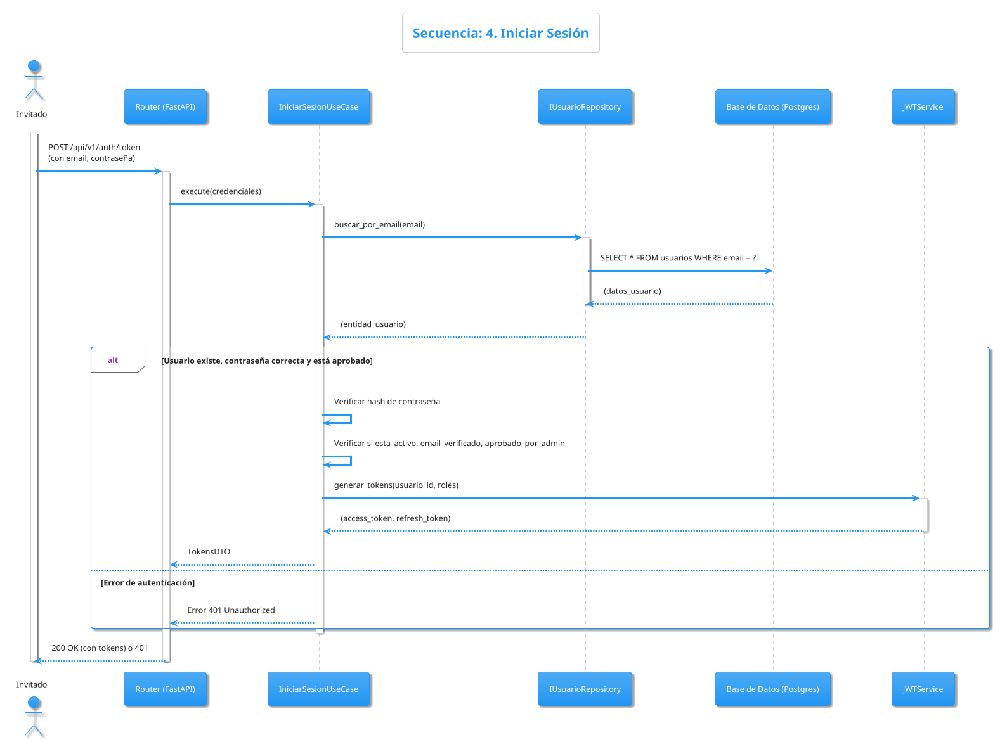
```plantuml
@startuml
!theme materia
title Secuencia: 4. Iniciar Sesión

actor Invitado
participant "Router (FastAPI)" as API
participant "IniciarSesionUseCase" as UseCase
participant "IUsuarioRepository" as Repo
participant "Base de Datos (Postgres)" as DB
participant "JWTService" as JWT

activate Invitado
Invitado -> API: POST /api/v1/auth/token\n(con email, contraseña)
activate API

API -> UseCase: execute(credenciales)
activate UseCase

UseCase -> Repo: buscar_por_email(email)
activate Repo
Repo -> DB: SELECT * FROM usuarios WHERE email = ?
DB --> Repo: (datos_usuario)
deactivate Repo
Repo --> UseCase: (entidad_usuario)

alt Usuario existe, contraseña correcta y está aprobado
    UseCase -> UseCase: Verificar hash de contraseña
    UseCase -> UseCase: Verificar si esta_activo, email_verificado, aprobado_por_admin
    UseCase -> JWT: generar_tokens(usuario_id, roles)
    activate JWT
    JWT --> UseCase: (access_token, refresh_token)
    deactivate JWT
    UseCase --> API: TokensDTO
else Error de autenticación
    UseCase --> API: Error 401 Unauthorized
end

deactivate UseCase
API --> Invitado: 200 OK (con tokens) o 401
deactivate API
deactivate Invitado
@enduml
```
---
### CASO DE USO 5: Solicitar Reseteo de Contraseña
---
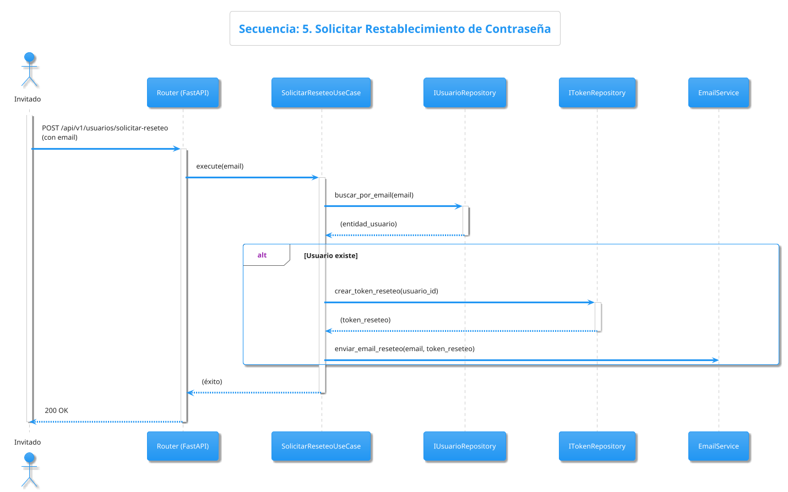
```plantuml
@startuml
!theme materia
title Secuencia: 5. Solicitar Restablecimiento de Contraseña

actor Invitado
participant "Router (FastAPI)" as API
participant "SolicitarReseteoUseCase" as UseCase
participant "IUsuarioRepository" as UserRepo
participant "ITokenRepository" as TokenRepo
participant "EmailService" as EmailService

activate Invitado
Invitado -> API: POST /api/v1/usuarios/solicitar-reseteo\n(con email)
activate API

API -> UseCase: execute(email)
activate UseCase

UseCase -> UserRepo: buscar_por_email(email)
activate UserRepo
UserRepo --> UseCase: (entidad_usuario)
deactivate UserRepo

alt Usuario existe
    UseCase -> TokenRepo: crear_token_reseteo(usuario_id)
    activate TokenRepo
    TokenRepo --> UseCase: (token_reseteo)
    deactivate TokenRepo
    UseCase -> EmailService: enviar_email_reseteo(email, token_reseteo)
end

UseCase --> API: (éxito)
deactivate UseCase

API --> Invitado: 200 OK
deactivate API
deactivate Invitado
@enduml
```
---
### CASO DE USO 6: Confirmar Nueva Contraseña
---
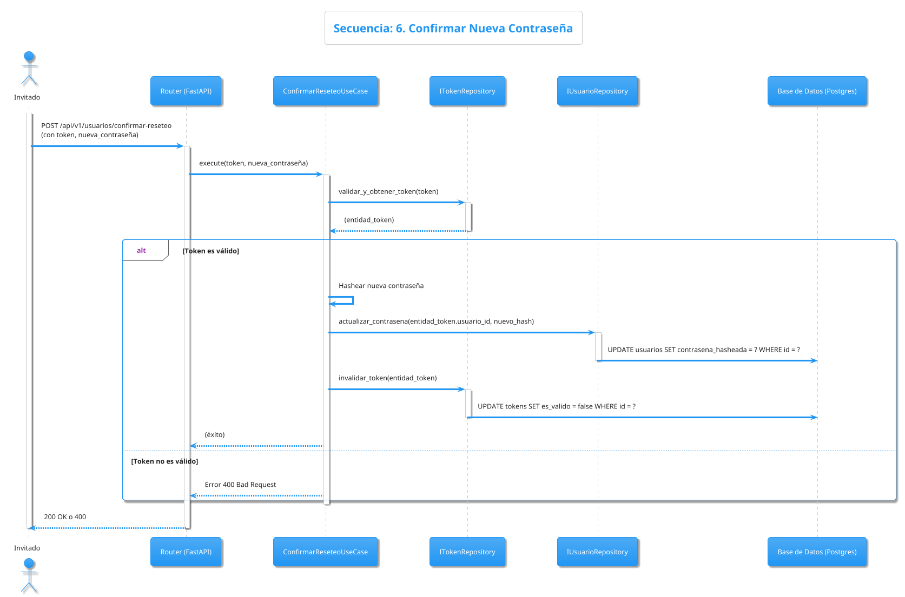
```plantuml
@startuml
!theme materia
title Secuencia: 6. Confirmar Nueva Contraseña

actor Invitado
participant "Router (FastAPI)" as API
participant "ConfirmarReseteoUseCase" as UseCase
participant "ITokenRepository" as TokenRepo
participant "IUsuarioRepository" as UserRepo
participant "Base de Datos (Postgres)" as DB

activate Invitado
Invitado -> API: POST /api/v1/usuarios/confirmar-reseteo\n(con token, nueva_contraseña)
activate API

API -> UseCase: execute(token, nueva_contraseña)
activate UseCase

UseCase -> TokenRepo: validar_y_obtener_token(token)
activate TokenRepo
TokenRepo --> UseCase: (entidad_token)
deactivate TokenRepo

alt Token es válido
    UseCase -> UseCase: Hashear nueva contraseña
    UseCase -> UserRepo: actualizar_contrasena(entidad_token.usuario_id, nuevo_hash)
    activate UserRepo
    UserRepo -> DB: UPDATE usuarios SET contrasena_hasheada = ? WHERE id = ?
    deactivate UserRepo
    
    UseCase -> TokenRepo: invalidar_token(entidad_token)
    activate TokenRepo
    TokenRepo -> DB: UPDATE tokens SET es_valido = false WHERE id = ?
    deactivate TokenRepo
    
    UseCase --> API: (éxito)
else Token no es válido
    UseCase --> API: Error 400 Bad Request
end

deactivate UseCase
API --> Invitado: 200 OK o 400
deactivate API
deactivate Invitado
@enduml

```
---

---
### CASO DE USO 7: Refrescar Sesión
---
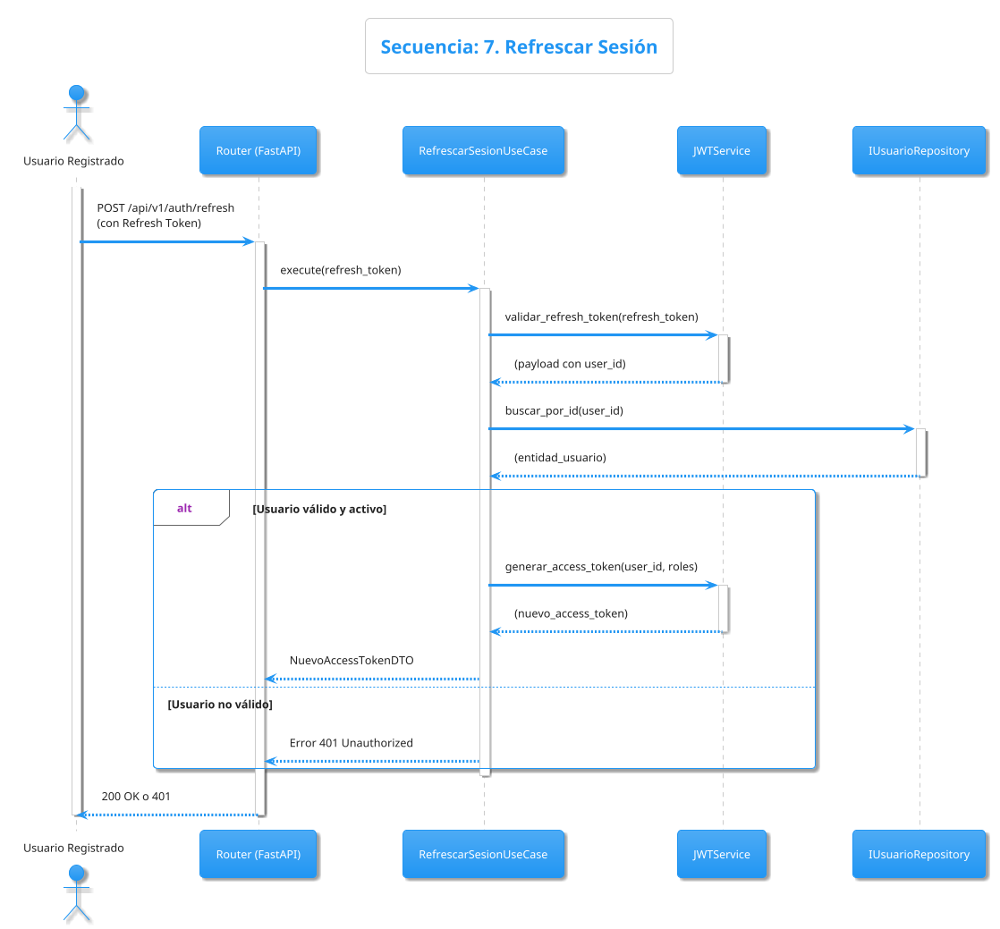
```plantuml
@startuml
!theme materia
title Secuencia: 7. Refrescar Sesión

actor "Usuario Registrado" as User
participant "Router (FastAPI)" as API
participant "RefrescarSesionUseCase" as UseCase
participant "JWTService" as JWT
participant "IUsuarioRepository" as Repo

activate User
User -> API: POST /api/v1/auth/refresh\n(con Refresh Token)
activate API

API -> UseCase: execute(refresh_token)
activate UseCase

UseCase -> JWT: validar_refresh_token(refresh_token)
activate JWT
JWT --> UseCase: (payload con user_id)
deactivate JWT

UseCase -> Repo: buscar_por_id(user_id)
activate Repo
Repo --> UseCase: (entidad_usuario)
deactivate Repo

alt Usuario válido y activo
    UseCase -> JWT: generar_access_token(user_id, roles)
    activate JWT
    JWT --> UseCase: (nuevo_access_token)
    deactivate JWT
    UseCase --> API: NuevoAccessTokenDTO
else Usuario no válido
    UseCase --> API: Error 401 Unauthorized
end

deactivate UseCase
API --> User: 200 OK o 401
deactivate API
deactivate User
@enduml
```
---

---
### CASO DE USO 8: Cerrar Sesión
---
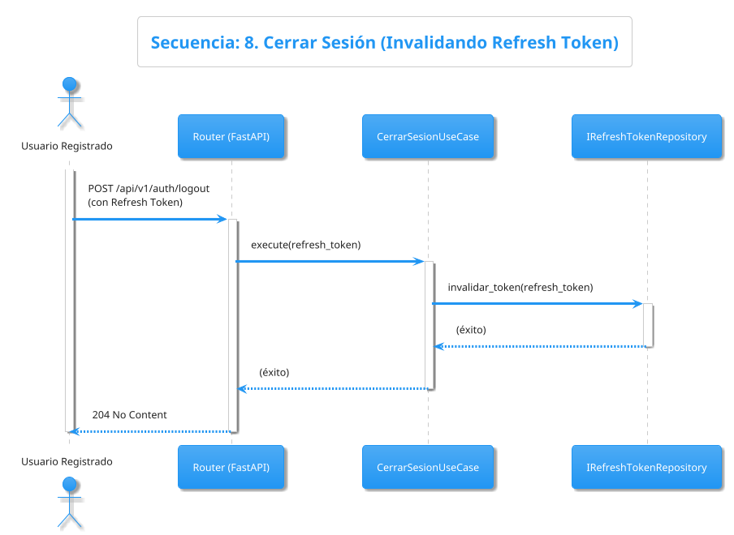
```plantuml
@startuml
!theme materia
title Secuencia: 8. Cerrar Sesión (Invalidando Refresh Token)

actor "Usuario Registrado" as User
participant "Router (FastAPI)" as API
participant "CerrarSesionUseCase" as UseCase
participant "IRefreshTokenRepository" as RefreshRepo

activate User
User -> API: POST /api/v1/auth/logout\n(con Refresh Token)
activate API

API -> UseCase: execute(refresh_token)
activate UseCase

' Este caso asume que los Refresh Tokens se guardan en BD para poder invalidarlos
UseCase -> RefreshRepo: invalidar_token(refresh_token)
activate RefreshRepo
RefreshRepo --> UseCase: (éxito)
deactivate RefreshRepo

UseCase --> API: (éxito)
deactivate UseCase

API --> User: 204 No Content
deactivate API
deactivate User
@enduml
```
---

---
### CASO DE USO 9: Ver Mi Perfil
---
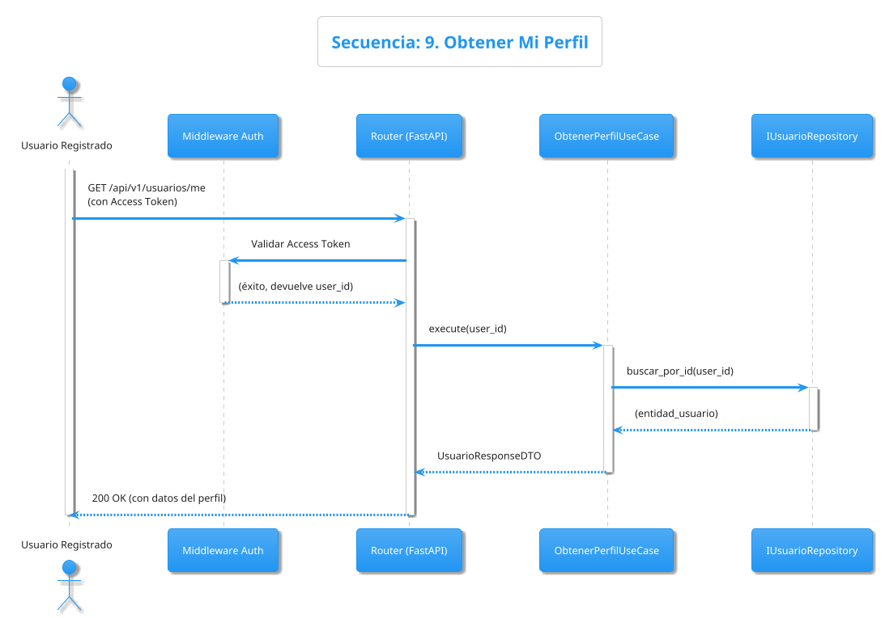
```plantuml
@startuml
!theme materia
title Secuencia: 9. Obtener Mi Perfil

actor "Usuario Registrado" as User
participant "Middleware Auth" as Auth
participant "Router (FastAPI)" as API
participant "ObtenerPerfilUseCase" as UseCase
participant "IUsuarioRepository" as Repo

activate User
User -> API: GET /api/v1/usuarios/me\n(con Access Token)
activate API

API -> Auth: Validar Access Token
activate Auth
Auth --> API: (éxito, devuelve user_id)
deactivate Auth

API -> UseCase: execute(user_id)
activate UseCase

UseCase -> Repo: buscar_por_id(user_id)
activate Repo
Repo --> UseCase: (entidad_usuario)
deactivate Repo

UseCase --> API: UsuarioResponseDTO
deactivate UseCase

API --> User: 200 OK (con datos del perfil)
deactivate API
deactivate User
@enduml
```
---

---
### CASO DE USO 10: Actualizar Mi Perfil
---
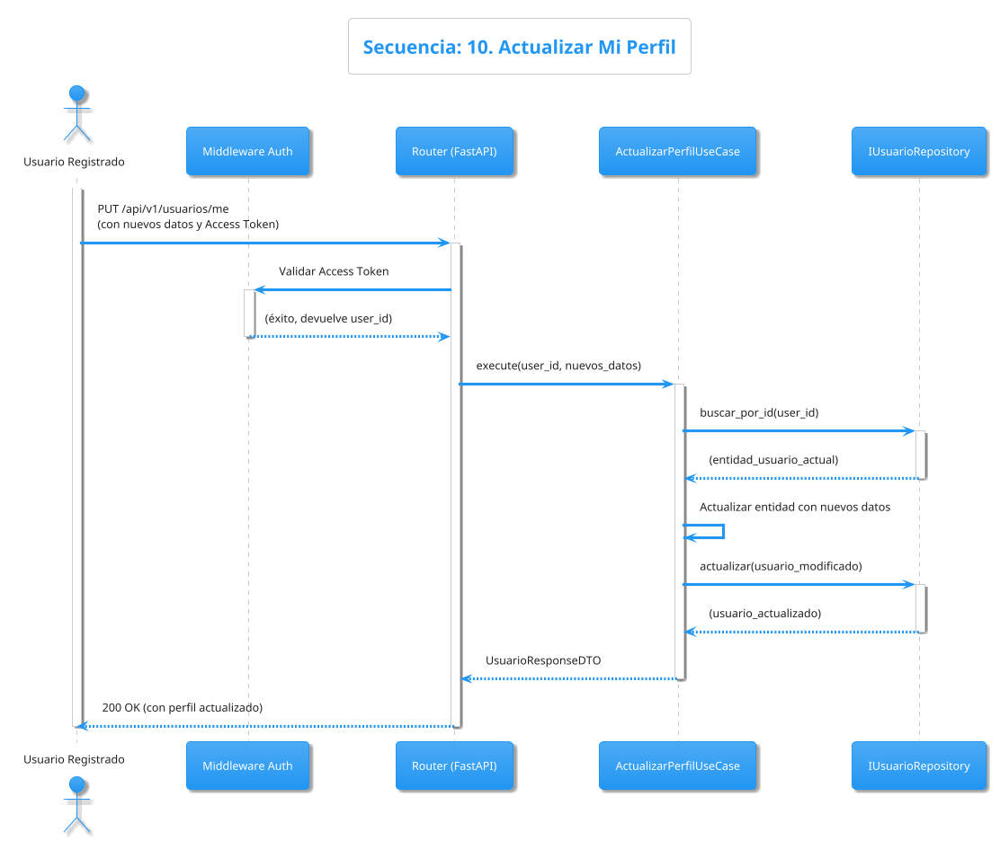
```plantuml
@startuml
!theme materia
title Secuencia: 10. Actualizar Mi Perfil

actor "Usuario Registrado" as User
participant "Middleware Auth" as Auth
participant "Router (FastAPI)" as API
participant "ActualizarPerfilUseCase" as UseCase
participant "IUsuarioRepository" as Repo

activate User
User -> API: PUT /api/v1/usuarios/me\n(con nuevos datos y Access Token)
activate API

API -> Auth: Validar Access Token
activate Auth
Auth --> API: (éxito, devuelve user_id)
deactivate Auth

API -> UseCase: execute(user_id, nuevos_datos)
activate UseCase

UseCase -> Repo: buscar_por_id(user_id)
activate Repo
Repo --> UseCase: (entidad_usuario_actual)
deactivate Repo

UseCase -> UseCase: Actualizar entidad con nuevos datos
UseCase -> Repo: actualizar(usuario_modificado)
activate Repo
Repo --> UseCase: (usuario_actualizado)
deactivate Repo

UseCase --> API: UsuarioResponseDTO
deactivate UseCase

API --> User: 200 OK (con perfil actualizado)
deactivate API
deactivate User
@enduml
```
---

---
### CASO DE USO 11: Cambiar Mi Contraseña
---
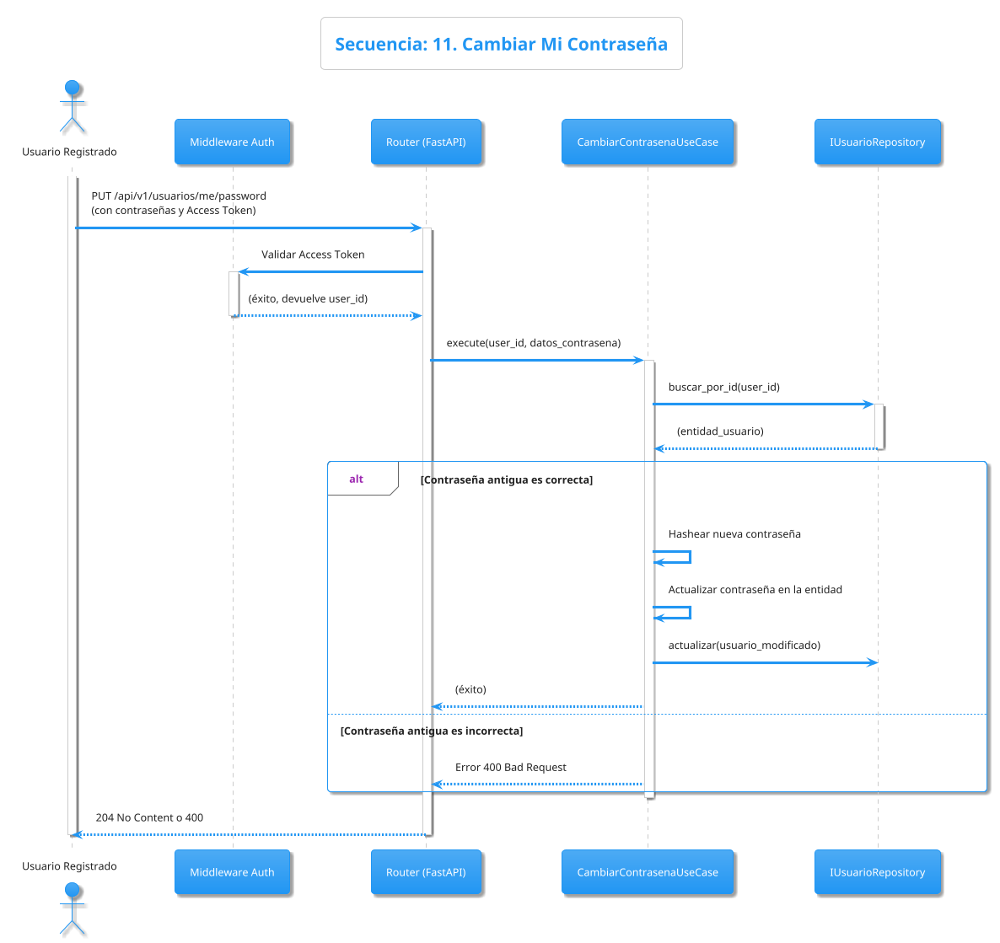
```plantuml
@startuml
!theme materia
title Secuencia: 11. Cambiar Mi Contraseña

actor "Usuario Registrado" as User
participant "Middleware Auth" as Auth
participant "Router (FastAPI)" as API
participant "CambiarContrasenaUseCase" as UseCase
participant "IUsuarioRepository" as Repo

activate User
User -> API: PUT /api/v1/usuarios/me/password\n(con contraseñas y Access Token)
activate API

API -> Auth: Validar Access Token
activate Auth
Auth --> API: (éxito, devuelve user_id)
deactivate Auth

API -> UseCase: execute(user_id, datos_contrasena)
activate UseCase

UseCase -> Repo: buscar_por_id(user_id)
activate Repo
Repo --> UseCase: (entidad_usuario)
deactivate Repo

alt Contraseña antigua es correcta
    UseCase -> UseCase: Hashear nueva contraseña
    UseCase -> UseCase: Actualizar contraseña en la entidad
    UseCase -> Repo: actualizar(usuario_modificado)
    UseCase --> API: (éxito)
else Contraseña antigua es incorrecta
    UseCase --> API: Error 400 Bad Request
end

deactivate UseCase
API --> User: 204 No Content o 400
deactivate API
deactivate User
@enduml
```
---

---
### CASO DE USO 12: Solicitar Eliminación de Cuenta
---
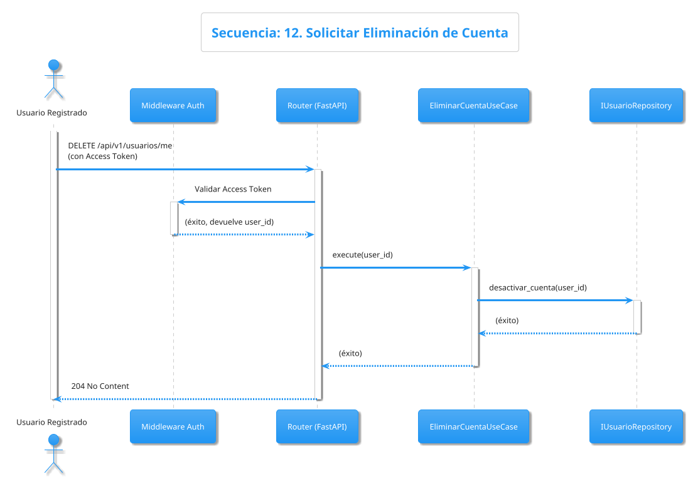
```plantuml
@startuml
!theme materia
title Secuencia: 12. Solicitar Eliminación de Cuenta

actor "Usuario Registrado" as User
participant "Middleware Auth" as Auth
participant "Router (FastAPI)" as API
participant "EliminarCuentaUseCase" as UseCase
participant "IUsuarioRepository" as Repo

activate User
User -> API: DELETE /api/v1/usuarios/me\n(con Access Token)
activate API

API -> Auth: Validar Access Token
activate Auth
Auth --> API: (éxito, devuelve user_id)
deactivate Auth

API -> UseCase: execute(user_id)
activate UseCase

' El caso de uso podría simplemente desactivar la cuenta
UseCase -> Repo: desactivar_cuenta(user_id)
activate Repo
Repo --> UseCase: (éxito)
deactivate Repo

UseCase --> API: (éxito)
deactivate UseCase

API --> User: 204 No Content
deactivate API
deactivate User
@enduml
```
---

---
### CASO DE USO 13:Listar Todos los Usuarios
---
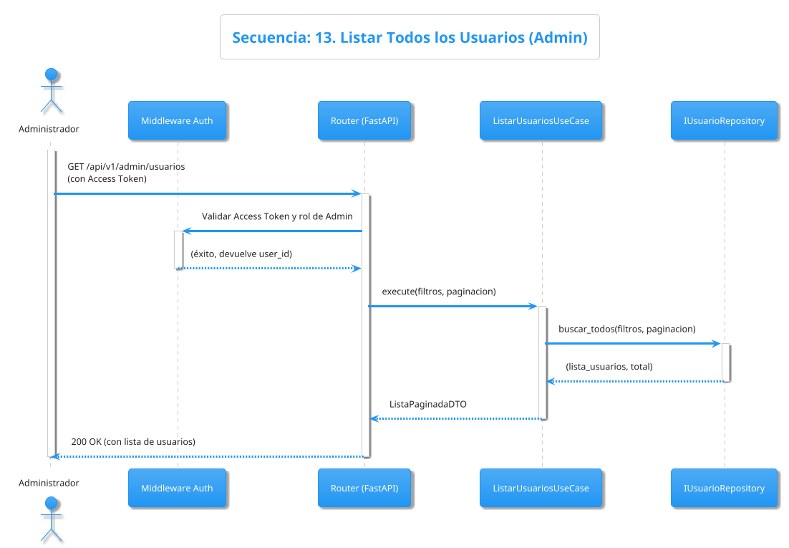
```plantuml
@startuml
!theme materia
title Secuencia: 13. Listar Todos los Usuarios (Admin)

actor Administrador
participant "Middleware Auth" as Auth
participant "Router (FastAPI)" as API
participant "ListarUsuariosUseCase" as UseCase
participant "IUsuarioRepository" as Repo

activate Administrador
Administrador -> API: GET /api/v1/admin/usuarios\n(con Access Token)
activate API

API -> Auth: Validar Access Token y rol de Admin
activate Auth
Auth --> API: (éxito, devuelve user_id)
deactivate Auth

API -> UseCase: execute(filtros, paginacion)
activate UseCase

UseCase -> Repo: buscar_todos(filtros, paginacion)
activate Repo
Repo --> UseCase: (lista_usuarios, total)
deactivate Repo

UseCase --> API: ListaPaginadaDTO
deactivate UseCase

API --> Administrador: 200 OK (con lista de usuarios)
deactivate API
deactivate Administrador
@enduml
```
---

---
### CASO DE USO 14:Ver Perfil de Otro Usuario
---
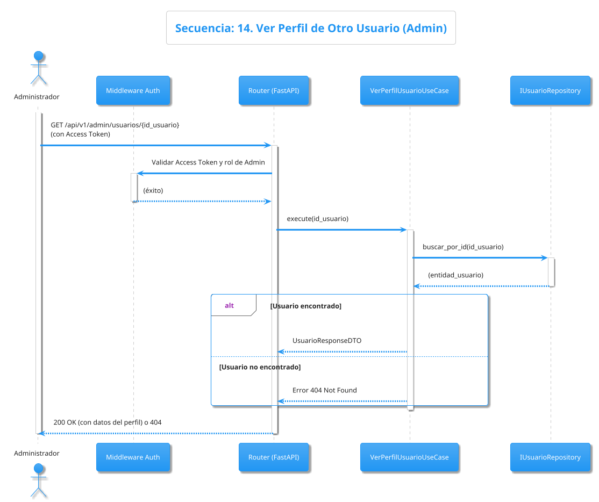
```plantuml
@startuml
!theme materia
title Secuencia: 14. Ver Perfil de Otro Usuario (Admin)

actor Administrador
participant "Middleware Auth" as Auth
participant "Router (FastAPI)" as API
participant "VerPerfilUsuarioUseCase" as UseCase
participant "IUsuarioRepository" as Repo

activate Administrador
Administrador -> API: GET /api/v1/admin/usuarios/{id_usuario}\n(con Access Token)
activate API

API -> Auth: Validar Access Token y rol de Admin
activate Auth
Auth --> API: (éxito)
deactivate Auth

API -> UseCase: execute(id_usuario)
activate UseCase

UseCase -> Repo: buscar_por_id(id_usuario)
activate Repo
Repo --> UseCase: (entidad_usuario)
deactivate Repo

alt Usuario encontrado
    UseCase --> API: UsuarioResponseDTO
else Usuario no encontrado
    UseCase --> API: Error 404 Not Found
end

deactivate UseCase
API --> Administrador: 200 OK (con datos del perfil) o 404
deactivate API
deactivate Administrador
@enduml
```
---
---
### CASO DE USO 15: Aprobar Nuevo Usuario (Admin)
---
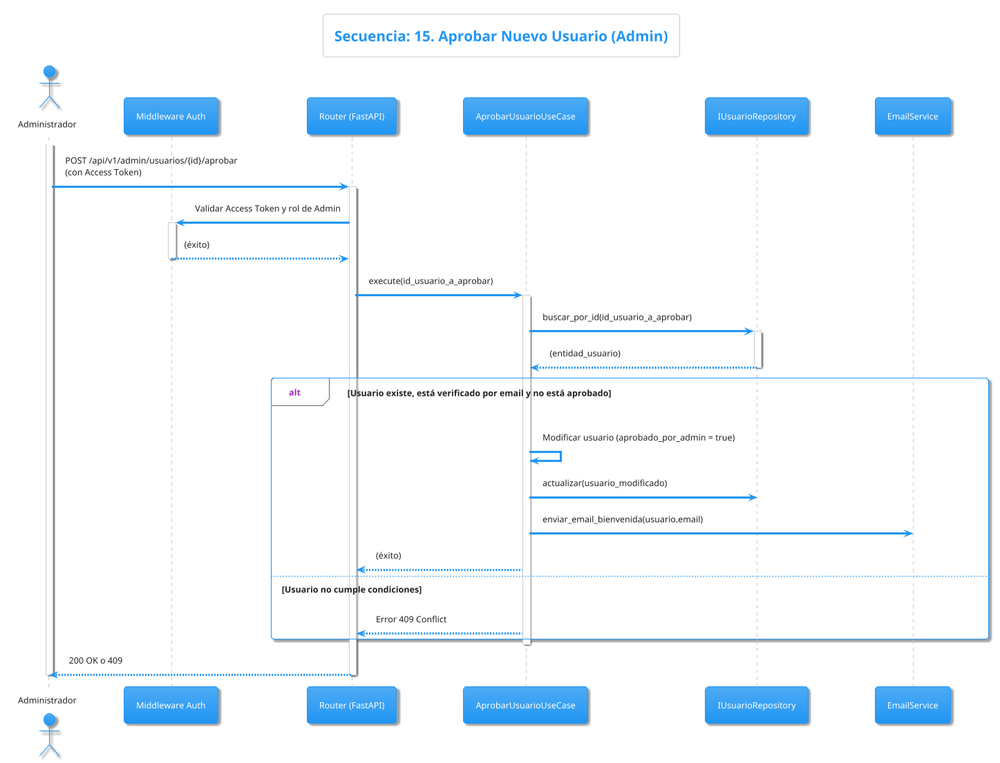
```plantuml
@startuml
!theme materia
title Secuencia: 15. Aprobar Nuevo Usuario (Admin)

actor Administrador
participant "Middleware Auth" as Auth
participant "Router (FastAPI)" as API
participant "AprobarUsuarioUseCase" as UseCase
participant "IUsuarioRepository" as Repo
participant "EmailService" as EmailService

activate Administrador
Administrador -> API: POST /api/v1/admin/usuarios/{id}/aprobar\n(con Access Token)
activate API

API -> Auth: Validar Access Token y rol de Admin
activate Auth
Auth --> API: (éxito)
deactivate Auth

API -> UseCase: execute(id_usuario_a_aprobar)
activate UseCase

UseCase -> Repo: buscar_por_id(id_usuario_a_aprobar)
activate Repo
Repo --> UseCase: (entidad_usuario)
deactivate Repo

alt Usuario existe, está verificado por email y no está aprobado
    UseCase -> UseCase: Modificar usuario (aprobado_por_admin = true)
    UseCase -> Repo: actualizar(usuario_modificado)
    UseCase -> EmailService: enviar_email_bienvenida(usuario.email)
    UseCase --> API: (éxito)
else Usuario no cumple condiciones
    UseCase --> API: Error 409 Conflict
end

deactivate UseCase
API --> Administrador: 200 OK o 409
deactivate API
deactivate Administrador
@enduml

```
---
---
### CASO DE USO 16: Rechazar Usuario (Admin)
---
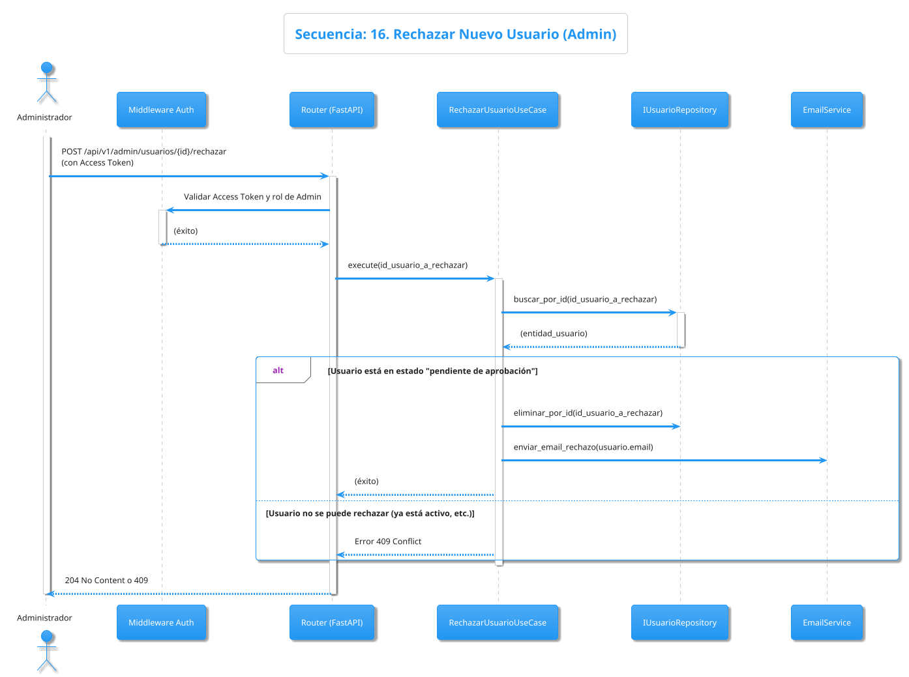
```plantuml
@startuml
!theme materia
title Secuencia: 16. Rechazar Nuevo Usuario (Admin)

actor Administrador
participant "Middleware Auth" as Auth
participant "Router (FastAPI)" as API
participant "RechazarUsuarioUseCase" as UseCase
participant "IUsuarioRepository" as Repo
participant "EmailService" as EmailService

activate Administrador
Administrador -> API: POST /api/v1/admin/usuarios/{id}/rechazar\n(con Access Token)
activate API

API -> Auth: Validar Access Token y rol de Admin
activate Auth
Auth --> API: (éxito)
deactivate Auth

API -> UseCase: execute(id_usuario_a_rechazar)
activate UseCase

UseCase -> Repo: buscar_por_id(id_usuario_a_rechazar)
activate Repo
Repo --> UseCase: (entidad_usuario)
deactivate Repo

alt Usuario está en estado "pendiente de aprobación"
    ' La lógica de negocio aquí podría ser borrarlo o marcarlo.
    ' Asumimos que se borra para simplificar.
    UseCase -> Repo: eliminar_por_id(id_usuario_a_rechazar)
    
    UseCase -> EmailService: enviar_email_rechazo(usuario.email)
    
    UseCase --> API: (éxito)
else Usuario no se puede rechazar (ya está activo, etc.)
    UseCase --> API: Error 409 Conflict
end

deactivate UseCase
API --> Administrador: 204 No Content o 409
deactivate API
deactivate Administrador
@enduml
```
---
---
### CASO DE USO 17: Activar/Desactivar Usuario (Admin)
---
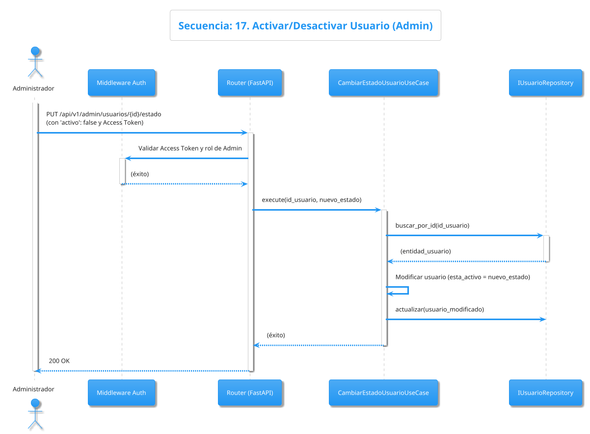
```plantuml
@startuml
!theme materia
title Secuencia: 17. Activar/Desactivar Usuario (Admin)

actor Administrador
participant "Middleware Auth" as Auth
participant "Router (FastAPI)" as API
participant "CambiarEstadoUsuarioUseCase" as UseCase
participant "IUsuarioRepository" as Repo

activate Administrador
Administrador -> API: PUT /api/v1/admin/usuarios/{id}/estado\n(con 'activo': false y Access Token)
activate API

API -> Auth: Validar Access Token y rol de Admin
activate Auth
Auth --> API: (éxito)
deactivate Auth

API -> UseCase: execute(id_usuario, nuevo_estado)
activate UseCase

UseCase -> Repo: buscar_por_id(id_usuario)
activate Repo
Repo --> UseCase: (entidad_usuario)
deactivate Repo

UseCase -> UseCase: Modificar usuario (esta_activo = nuevo_estado)
UseCase -> Repo: actualizar(usuario_modificado)

UseCase --> API: (éxito)
deactivate UseCase

API --> Administrador: 200 OK
deactivate API
deactivate Administrador
@enduml
```
---
---
### CASO DE USO 18: Modificar Roles de Usuario (Admin)
---
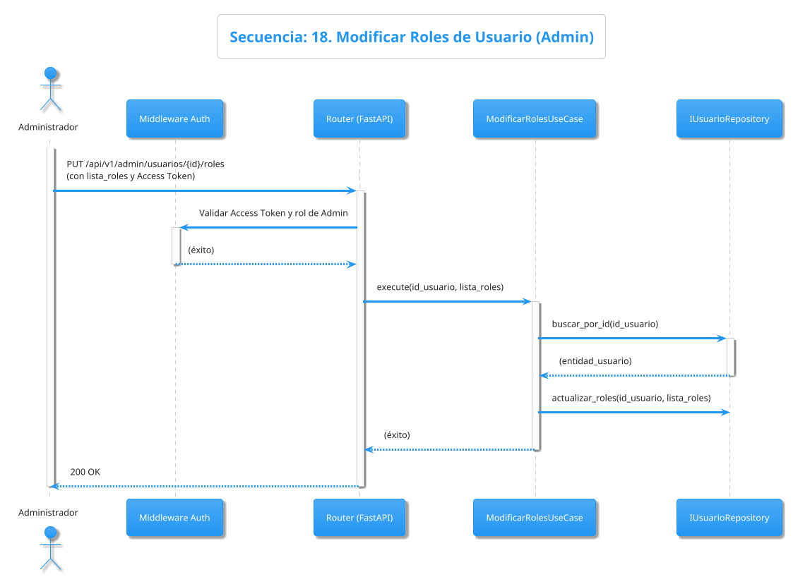
```plantuml
@startuml
!theme materia
title Secuencia: 18. Modificar Roles de Usuario (Admin)

actor Administrador
participant "Middleware Auth" as Auth
participant "Router (FastAPI)" as API
participant "ModificarRolesUseCase" as UseCase
participant "IUsuarioRepository" as Repo

activate Administrador
Administrador -> API: PUT /api/v1/admin/usuarios/{id}/roles\n(con lista_roles y Access Token)
activate API

API -> Auth: Validar Access Token y rol de Admin
activate Auth
Auth --> API: (éxito)
deactivate Auth

API -> UseCase: execute(id_usuario, lista_roles)
activate UseCase

UseCase -> Repo: buscar_por_id(id_usuario)
activate Repo
Repo --> UseCase: (entidad_usuario)
deactivate Repo

UseCase -> Repo: actualizar_roles(id_usuario, lista_roles)

UseCase --> API: (éxito)
deactivate UseCase

API --> Administrador: 200 OK
deactivate API
deactivate Administrador
@enduml
```
---
---
### CASO DE USO 19: Desbloquear Cuenta (Admin)
---
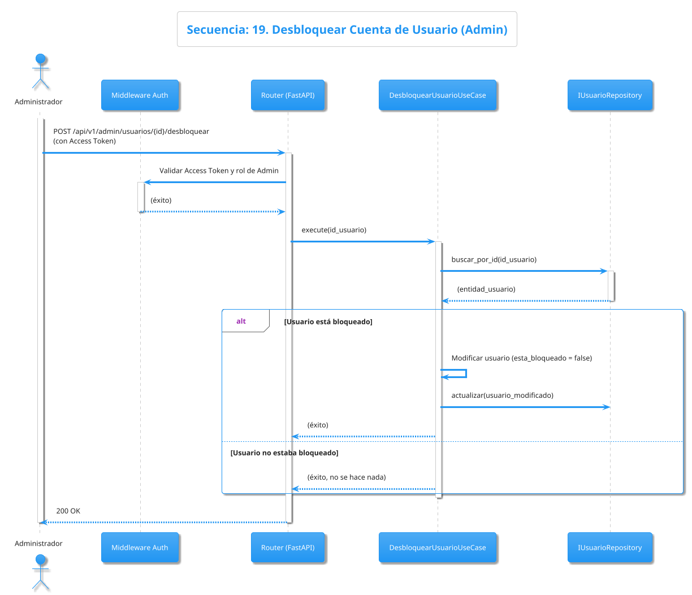
```plantuml
@startuml
!theme materia
title Secuencia: 19. Desbloquear Cuenta de Usuario (Admin)

actor Administrador
participant "Middleware Auth" as Auth
participant "Router (FastAPI)" as API
participant "DesbloquearUsuarioUseCase" as UseCase
participant "IUsuarioRepository" as Repo

activate Administrador
Administrador -> API: POST /api/v1/admin/usuarios/{id}/desbloquear\n(con Access Token)
activate API

API -> Auth: Validar Access Token y rol de Admin
activate Auth
Auth --> API: (éxito)
deactivate Auth

API -> UseCase: execute(id_usuario)
activate UseCase

UseCase -> Repo: buscar_por_id(id_usuario)
activate Repo
Repo --> UseCase: (entidad_usuario)
deactivate Repo


alt Usuario está bloqueado
    UseCase -> UseCase: Modificar usuario (esta_bloqueado = false)
    UseCase -> Repo: actualizar(usuario_modificado)
    UseCase --> API: (éxito)
else Usuario no estaba bloqueado
    UseCase --> API: (éxito, no se hace nada)
end

deactivate UseCase
API --> Administrador: 200 OK
deactivate API
deactivate Administrador
@enduml
```
---
---
### CASO DE USO 20: Eliminar Usuario (Admin)
---
```plantuml
@startuml
!theme materia
title Secuencia: 20. Eliminar Permanentemente a un Usuario (Admin)

actor Administrador
participant "Middleware Auth" as Auth
participant "Router (FastAPI)" as API
participant "EliminarUsuarioAdminUseCase" as UseCase
participant "IUsuarioRepository" as Repo
participant "Base de Datos (Postgres)" as DB

activate Administrador
Administrador -> API: DELETE /api/v1/admin/usuarios/{id}\n(con Access Token)
activate API

API -> Auth: Validar Access Token y rol de Admin
activate Auth
Auth --> API: (éxito)
deactivate Auth

API -> UseCase: execute(id_usuario)
activate UseCase

UseCase -> Repo: eliminar_por_id(id_usuario)
activate Repo
Repo -> DB: DELETE FROM usuarios WHERE id = ?\n(y borrado en cascada)
activate DB
DB --> Repo: (éxito)
deactivate DB
Repo --> UseCase: (éxito)
deactivate Repo

UseCase --> API: (éxito)
deactivate UseCase
API --> Administrador: 204 No Content
deactivate API
deactivate Administrador
@enduml
```
---
---
### CASO DE USO 21: Forzar Reseteo de Contraseña (Admin)
---
```plantuml
@startuml
!theme materia
title Secuencia: 21. Forzar Reseteo de Contraseña (Admin)

actor Administrador
participant "Middleware Auth" as Auth
participant "Router (FastAPI)" as API
participant "ForzarReseteoUseCase" as UseCase
participant "IUsuarioRepository" as UserRepo
participant "ITokenRepository" as TokenRepo
participant "EmailService" as EmailService

activate Administrador
Administrador -> API: POST /api/v1/admin/usuarios/{id}/forzar-reseteo\n(con Access Token)
activate API

API -> Auth: Validar Access Token y rol de Admin
activate Auth
Auth --> API: (éxito)
deactivate Auth

API -> UseCase: execute(id_usuario)
activate UseCase

UseCase -> UserRepo: buscar_por_id(id_usuario)
activate UserRepo
UserRepo --> UseCase: (entidad_usuario)
deactivate UserRepo

alt Usuario existe
    UseCase -> TokenRepo: crear_token_reseteo(id_usuario)
    activate TokenRepo
    TokenRepo --> UseCase: (token_reseteo)
    deactivate TokenRepo
    UseCase -> EmailService: enviar_email_reseteo(usuario.email, token_reseteo)
end

UseCase --> API: (éxito)
deactivate UseCase

API --> Administrador: 200 OK
deactivate API
deactivate Administrador
@enduml
```
---